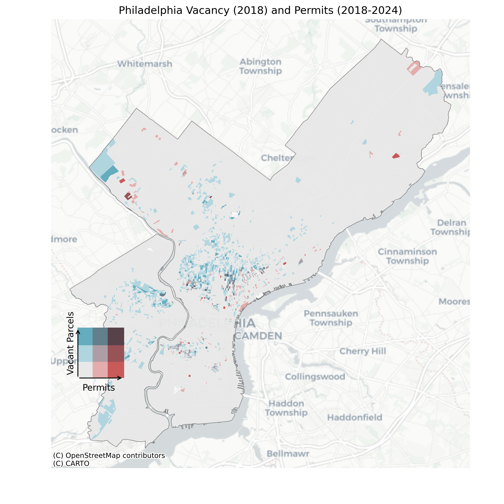
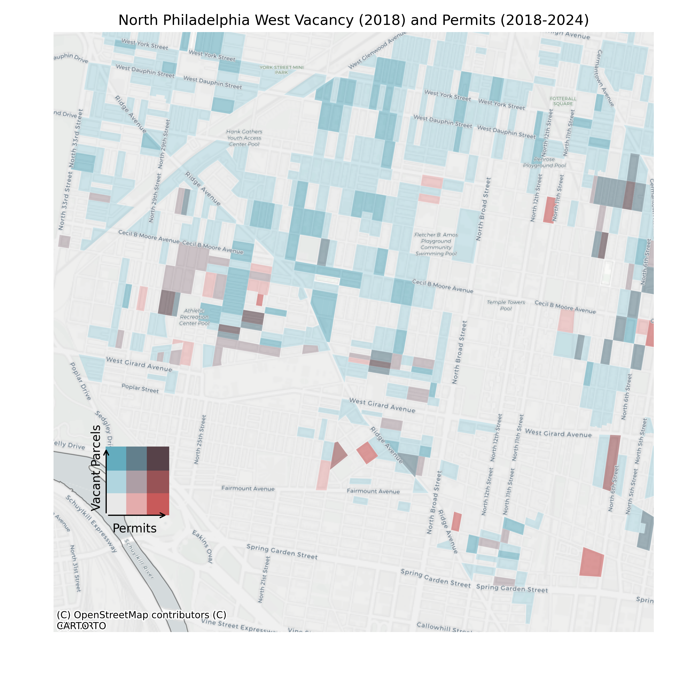

# Philadelphia Infill Analysis

Will Parker — Command-Line GIS with Will Payne — Fall 2024 — Bloustein School @ Rutgers

This project emerged from the observation that many parts of Philadelphia with a high proportion of vacant lots have been filling in over the last few years, while other high-vacancy areas have remained stable. My analysis is a block-by-block city-wide comparison of the number of vacant lots as of 2018 and the number of permits issues since 2018 for new residential construction. The goal is to identify "infill hotspots" where the number of vacant lots in 2018 was high and the number of permits since then is also high.

The data for this analysis came as geojsons downloaded from Open Data Philly, courtesy of the City of Philadelphia. Vacant lot data for 2018 is current as of 2018, and the building permit data contains entries dated well into 2024. Data processing and data quality issues are described at the end.

The first map produced is a bivariate choropleth showing both 2018 vacancy and permits since 2018 for the entire city. This form is particularly useful because it makes typologies very visually apparent. Most of the city falls in the grey, stable category. Many parts of the Northwest and North fall in a category of continued high vacancy. A few areas with unique redevelopment circumstances have few vacant parcels and many permits. Finally, incidences of the in-fill category, where many vacant lots existed in 2018 and many have since been developed, occur on a small enough scale to be almost invisible.

To see this map as its own web page, click [here](citywide_bivariate_choropleth.png)

Most of these in-fill areas fall in the North, so a detailed map of North Philadelphia is shown below. Many in-fill blocks occur just south of Cecil B Moore Avenue near 27th Street, and east of Broad Street between Cecil B Moore Avenue and Germantown Avenue. 

To see this map as its own web page, click [here](north_bivariate_choropleth.png)

These clustered in-fill blocks in the North show a pattern, overlapping significantly (MAYBE) with tract-level areas of high poverty.

INTERACTIVE MAP UNDER CONSTRUCTION
<iframe src="citywide_bivariate_choropleth.png" height="500" width="500"></iframe>
To see this map as its own web page, click [here](phila_pools2024.html)

## Data Quality and Processing Notes

Georeferenced Building Permit data for the city of Philadelphia was available as point data for the periods 2007-2015 and 2016-present, and could be sorted for only permits authorizing new construction. Land Use data for the period 2012-2018 was also available on a parcel level as polygon data. While filtering Land Use to only vacant lands was a simple line of code, the building permit data was a substantial challenge. A project description was available for each permit, and I used this to piece together the combinations of two different fields ("permitdesc" and "typeofwork") which yielded only permits authorizing new residential construction. The meanings were not immediate obvious--for example, homes were classified as typeofwork ENTIRE, but I also had to include pre-fabricated homes using typeofwork MOD/IN.

The parcel data did not appear to have any identification of tax blocks, so I opted to instead to use census blocks as a geography to aggregate both a count of vacancies and a count of permits. I pulled this geography and the city boundary directly using pygris. Because census blocks extend to the middle of streets while lot lines do not, all permit points and vacancy polygons fell within their blocks and very simple spatial join allowed me to count the number of each in a given block.

One issue which became apparent is that approximately 200 building permits contained a null geometry attribute. They did, however, contain a string address field. To use these entries, I isolated them from the rest of the data and exported to another notebook, where I used an existing workflow to geocode them and merge them back together with the other building permits. 

